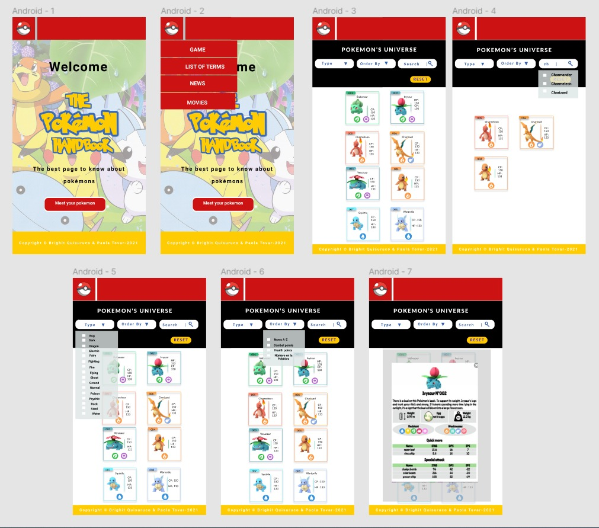
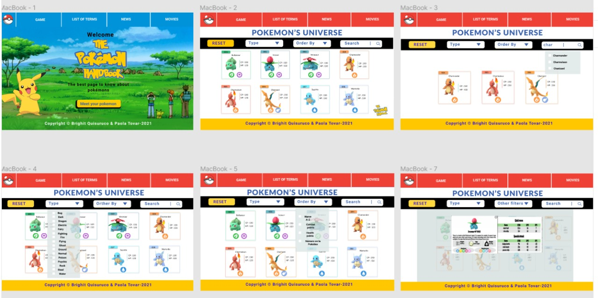

  
# Data Lovers

## 1. Resumen del proyecto

Este proyecto tiene como finalidad construir una página web , en la cual va interactuar con una base de datos externa, la misma que cuenta con la información de los 251 Pokémones . En este proyecto se  se va importar y extraer los datos requeridos, según las necesidades de nuestro usuario final. Validamos que el usuario puede filtrar,ordenar y buscar la información por nombre y al darle click al pokemon podrá visualizar más información del pokemón y validar el cálculo agregado.

## 2. Descripción del proyecto

Esta página web es un proyecto dirigido a los jugadores nuevos y antiguos  en la cual puedan validar información relevante de sus pokémon nuestro proyecto tiene la finalidad de mejorar la experiencia que estos tienen, los usuarios podrán validar las características de los pokémones.

### 2.1 Proceso del diseño

Para el proyecto se opto por un estilo que nuestra página se asemeje a una pokebola inicialmente escogimos el rojo y el negro,a su vez el usuario pueda  validar la información requerida.

### 2.2 Vista Final de nuestro proyecto
  
    

# 3.Diseño UX  

## 3.1 Investigación de jugadores pokémon

### Hallazgos

Los entrenadores de Pokémon Go tienen como objetivo coleccionar diferentes tipos de Pokémon para completar su Pokédex. Además, usan sus Pokémon para enfrentarse a otros entrenadores u otros Pokémon mientras realizan incursiones y batallan en gimnasios.

### Atrapar y coleccionar los Pokémon

Los Pokémon aparecen en estado salvaje (mientras caminan por la calle) donde pueden ser capturados por los entrenadores. Hay Pokémon que aparecen con más frecuencia que otros. Por ejemplo, es muy difícil encontrar alguna evolución de un Pokémon. Algunos Pokémon pueden evolucionar a otra forma (ej. Pikachu a Raichu), pero necesitan una cantidad determinada de caramelos para poder evolucionar, los cuales se obtienen cada vez que captura a un Pokémon de su misma especie. Por ejemplo, cada vez que se captura a un Pikachu el entrenador obtiene 3 caramelos tipo Pikachu. Al final necesita 25 para poder evolucionarlo a Raichu. La cantidad de caramelos necesaria para evolucionar un Pokémon varía de una especie a otra.

### Datos que te ayudarán a atrapar y coleccionar pokémones

Encounter: % Base de Huida y % Base de Captura.
Spaw-chance: Frecuencia de aparición de un pokémon.
Egg: En qué tipo de huevos aparece el pokémon.
Buddy-distance-km: Distancia en km que debe caminar el usuario con un pokémon con buddy para obtener 1 caramelo de dicho pokémon.
Evolution: Tipo de caramelo, siguiente evolución y anterior evolución, si necesita algún ítem para evolucionar.

### Datos que nos ayudarán para pelear

Stats: Base de Ataque, Defensa y Salud + Máx. CP (máx. puntos de combate) y Máx. HP (máx. puntos de salud).
Resistant: A qué tipos de pokémon es resistente.
Weaknesses: Contra qué tipos de pokémon es débil.
Quick-move: Movimientos rápidos.
Special-attack: Ataques especiales

###  Datos que puedo obtener de acá

1.Qué pokémon tiene mayor punto de combate y mayor punto de salud.
2.Algunas veces el usuario tiene que elegir a los que tienen menos cantidad de debilidades y/o resistencia y saber de qué tipo son. Por ello, es importante para un maestro Pokémon poder ordenarlos por estas 3 características.
3.STAB:Same Type Attack Bonus, traducido como Bonificación por Ataque del Mismo Tipo. Se calcula así: si el Pokémon que usa el movimiento es del mismo tipo que el movimiento, el daño aumenta en un 20%
4.DPS: El daño por segundo se calcula dividiendo el daño base del movimiento por el STAB entre el tiempo que toma el movimiento.
5.EPS: La energia por movimiento se calcula dividiendo la energía entre el tiempo que toma el movimiento.
6.El mejor set de movimientos: calcula cuál es la mejor combinación de quick-move con special-attack para ataque y defensa en gimnasios.
Nota: Tanto quick move como special attack tienen información de cada movimiento: nombre, tipo, base de daño, energía, duración del movimiento(seg).

## 3.2 Historias de usuario y criterios de aceptación

### Historia de usuario 1 y 2 - Visualizar todos los Pokémones

🙋‍♀️ YO, COMO usuario pokémon, QUIERO que al ingresar a mi handbook quiero visualizar todos mis pokemones.

### Criterios de Aceptación:

✔ Visualizar en la pantalla la imagen del pokemon, el nombre, el numero de pokemon que es , CP y HP, de los 251 pokémones. 
✔ Ver a los 251 pokémones ordenados por su ID. 
✔La visualización de pokémon se  valida en desktop y mobile. 

### Definición de Terminado:

✔ El código no tiene correcciones de ESLINT. 
✔ La función creada para mostrar a los pokemones funciona correctamente. 
✔ La historia de usuario está desplegada en GitPages. 

## Historia de usuario 3 - Visualización de pokémon por tipo

🙋‍♀️YO, COMO usuario pokémon , QUIERO se filtren los pokémon por tipo de elemento.

### Criterios de Aceptación:

✔ Se puede visualizar los pokémon por tipo. 
✔ El usuario puede visualizar en la lista desplegable todos los tipos de pokémon. 
✔ La lista desplegable debe permitir seleccionar solo un tipo de pokémon. 

### Definición de Terminado

✔ Todos los criterios de aceptación son cumplidos. 
✔ El código tiene y pasa los test respectivos. 
✔La historia de usuario se visualiza en GitPages. 
✔El código no tiene errores en ESLINT. 

## Historia de usuario 4 - Búsqueda personalizada

🙋‍♀️ YO, COMO usuario pokémon , QUIERO  buscar un pokémon en especifico mediante un buscador.
de manera rápida.

### Criterios de Aceptación:

✔ Buscar a los pokemones a través de su nombre. 
✔ Visualizar un mensaje en caso el input insertado no valide algún pokémon. 
✔La búsqueda de los pokemones debe visualizarse en dispositivos desktop y mobile. 

### Definición de Terminado:
✔ Todos los criterios de aceptación son cumplidos. 
✔ El codigo tiene y pasa los test respectivos (como minimo el 70 %). 
✔ La historia de usuario se encuentra en GitPages. 

## Historia de usuario 5 - Visualizar la ficha Técnica de cada Pokémon

🙋‍♀️ YO, COMO usuario pokemon , QUIERO visualizar información más detallada de cada pokémon.

### Criterios de Aceptación:

✔ Se puede visualizar la información de cada pokémon al hacer clic en el área que ocupa este. 
✔ El usuario podrá ver la información detallada en una modal. 
✔ El usuario puede volver a visualizar todos los pokemones al cerrar el modal.

### Definición de Terminado:

✔ Todos los criterios de aceptación son cumplidos. 
✔ Todas las pruebas unitarias son correctas. 
✔ La historia de usuario se encuentra en GitPages.

# 3.3 Prototipo de baja fidelidad

# 4.Objetivos de aprendizaje
UX  
 Diseñar la aplicación pensando y entendiendo al usuario.
 Crear prototipos para obtener feedback e iterar. 
✔ Aplicar los principios de diseño visual (contraste, alineación, jerarquía). 
✔ Planear y ejecutar tests de usabilidad. 

HTML y CSS 
✔ Entender y reconocer por qué es importante el HTML semántico. 
✔ Identificar y entender tipos de selectores en CSS. 
✔ Entender cómo funciona flexbox en CSS. 
✔ Construir tu aplicación respetando el diseño planeado (maquetación). 

DOM 
✔ Entender y reconocer los selectores del DOM (querySelector | querySelectorAll). 
✔ Manejar eventos del DOM. (addEventListener) 
✔ Manipular dinámicamente el DOM. (createElement, appendchild, innerHTML, value). 

Javascript 
✔ Manipular arrays (filter | map | sort | reduce). 
✔ Manipular objects (key | value). 
✔ Entender el uso de condicionales (if-else | switch). 
✔ Entender el uso de bucles (for | forEach). 
[-] Entender la diferencia entre expression y statements. 
✔ Utilizar funciones (parámetros | argumentos | valor de retorno). 
✔ Entender la diferencia entre tipos de datos atómicos y estructurados. 
✔ Utilizar ES Modules (import | export). 
Pruebas Unitarias (testing) 
✔ Testear funciones (funciones puras). 

Git y GitHub 
✔ Ejecutar comandos de git (add | commit | pull | status | push). 
✔ Utilizar los repositorios de GitHub (clone | fork | gh-pages). 

Buenas prácticas de desarrollo 
✔ Organizar y dividir el código en módulos (Modularización). 
✔ Utilizar identificadores descriptivos (Nomenclatura | Semántica). 
✔ Utilizar linter para seguir buenas prácticas (ESLINT). 

# 5. Consideraciones generales

<<<<<<< HEAD
✔ Este proyecto se realizó en dupla. 
✔ La interfaz del proyecto esta desplegada usando GitHub Pages. 
✔ Se realizó en 4 semanas. 

# 6. Checklist 
✔ Usa VanillaJS. 
✔ No hace uso de this. 
[-] Pasa linter (npm run pretest) 
✔] Pasa tests (npm test) 
✔ Pruebas unitarias cubren un mínimo del 70% de statements, functions y lines y branches. 
✔ Incluye Definición del producto clara e informativa en README.md. 
✔ Incluye historias de usuario en README.md. 
✔ Incluye sketch de la solución (prototipo de baja fidelidad) en README.md. 
✔ Incluye Diseño de la Interfaz de Usuario (prototipo de alta fidelidad) en README.md. 
[x] Incluye link a Zeplin/Loom en README.md. 
✔ Incluye el listado de problemas que detectaste a través de tests de usabilidad en el README.md. 
[〰️] UI: Muestra lista y/o tabla con datos y/o indicadores. 
✔ UI: Permite ordenar data por uno o más campos (asc y desc). 
✔ UI: Permite filtrar data en base a una condición.
[-] UI: Es responsive. 
=======
✔ Este proyecto se realizó en dupla.
✔ La interfaz del proyecto esta desplegada usando GitHub Pages.
✔ Se realizó en 4 semanas.

# 6. Checklist 
✔ Usa VanillaJS.
✔ No hace uso de this.
[-] Pasa linter (npm run pretest)
✔] Pasa tests (npm test)
✔ Pruebas unitarias cubren un mínimo del 70% de statements, functions y lines y branches.
✔ Incluye Definición del producto clara e informativa en README.md.
✔ Incluye historias de usuario en README.md.
✔ Incluye sketch de la solución (prototipo de baja fidelidad) en README.md.
✔ Incluye Diseño de la Interfaz de Usuario (prototipo de alta fidelidad) en README.md.
[x] Incluye link a Zeplin/Loom en README.md.
✔ Incluye el listado de problemas que detectaste a través de tests de usabilidad en el README.md.
[〰️] UI: Muestra lista y/o tabla con datos y/o indicadores.
✔ UI: Permite ordenar data por uno o más campos (asc y desc).
✔ UI: Permite filtrar data en base a una condición.
[-] UI: Es responsive.
>>>>>>> 3c9abd7b925b6cf11dd45a40cf46c60598018574
